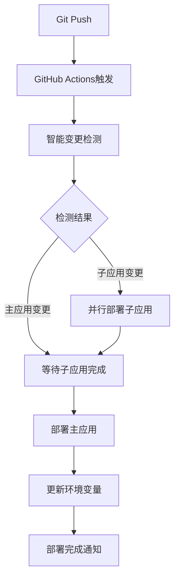
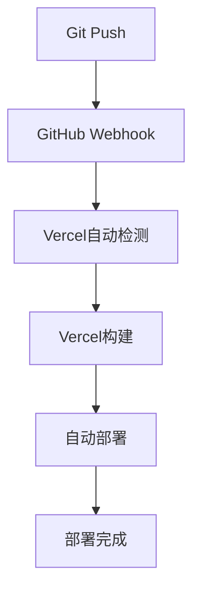

# GitHub Actions 工作流说明

本目录包含项目的自动化部署和CI/CD配置文件。

## 📁 文件列表

### 🚀 当前唯一活跃的工作流

#### `deploy-vercel-auto.yml` ⭐
- **用途**: GitHub Actions主动式Vercel部署（当前唯一活跃的部署方式）
- **触发**: 推送到main/master分支，Pull Request
- **部署方式**: 使用Vercel CLI在GitHub Actions中执行部署
- **特性**: 
  - 智能变更检测，只部署变更的应用
  - 并行部署子应用，提升效率
  - 自动配置环境变量
  - PR预览部署
  - 部署状态通知
  - 完全由GitHub Actions控制部署流程
- **状态**: ✅ 活跃使用

### 📁 所有备用方案已移动到备用目录 ([workflows-backup/](../workflows-backup/))

为了保持GitHub Actions界面的整洁，所有备用和禁用的工作流文件都已移动到备用目录。

#### 已移动的文件：
- ✅ `deploy-vercel.yml` - Vercel原生GitHub集成部署
- ✅ `deploy-cloud-server.yml` - 云服务器Docker化部署  
- ✅ `deploy-pages.yml` - GitHub Pages静态站点部署
- ✅ `deploy.yml` - 通用微前端应用部署

**移动原因**: 当前项目专注于使用单一的、经过验证的部署方式，避免配置复杂性和潜在冲突。

**访问备用方案**: 查看 [workflows-backup目录](../workflows-backup/) 了解详细的备用部署方案说明。

## 🔄 部署策略说明

### 当前策略：GitHub Actions + Vercel
```
主要部署方式: GitHub Actions主动部署到Vercel
备用方案: 云服务器(Docker) + GitHub Pages + Vercel原生集成
```

**选择GitHub Actions主动部署的原因**:
- ✅ 完全控制部署流程和时机
- ✅ 智能变更检测，提升部署效率
- ✅ 自定义部署逻辑和环境变量管理
- ✅ 详细的部署日志和状态反馈
- ✅ 支持复杂的微前端部署策略
- ✅ 可以集成测试、构建验证等流程

### 🆚 两种Vercel部署方式对比

| 特性 | GitHub Actions部署 | Vercel原生集成 |
|------|-------------------|----------------|
| **控制程度** | 🟢 完全控制 | 🟡 Vercel控制 |
| **自定义逻辑** | 🟢 高度自定义 | 🔴 受限 |
| **变更检测** | 🟢 智能检测 | 🟡 全量部署 |
| **并行部署** | 🟢 自定义并行 | 🔴 顺序部署 |
| **环境变量** | 🟢 动态设置 | 🟡 手动配置 |
| **部署速度** | 🟡 中等 | 🟢 较快 |
| **配置复杂度** | 🔴 较复杂 | 🟢 简单 |
| **错误处理** | 🟢 详细日志 | 🟡 有限信息 |
| **微前端支持** | 🟢 完美支持 | 🟡 需要配置 |

### GitHub Actions部署流程 (当前使用)


### Vercel原生集成流程 (备用方案)


1. **开发** → 推送代码到分支
2. **检测** → 智能检测变更的应用
3. **构建** → 并行构建子应用
4. **部署** → 子应用先部署，主应用后部署
5. **通知** → 部署结果通知

## 📊 部署矩阵

| 部署方式 | 平台 | 成本 | 速度 | 复杂度 | 状态 |
|---------|------|------|------|--------|------|
| Vercel | Vercel | 免费 | 快 | 低 | 使用中 |
| Docker | 云服务器 | 付费 | 中 | 高 | 备用 |
| Pages | GitHub | 免费 | 中 | 低 | 备用 |

## 🛠️ 使用指南

### 修改部署配置
1. **Vercel配置**: 修改 `deploy-vercel-auto.yml`
2. **Docker配置**: 修改 `deploy-cloud-server.yml`
3. **Pages配置**: 修改 `deploy-pages.yml`

### 切换部署方式

#### 1. 切换到Vercel原生集成
``bash
# 禁用GitHub Actions部署
1. 注释掉 deploy-vercel-auto.yml 中的 on: 配置
2. 启用 deploy-vercel.yml 中的 on: 配置
3. 在Vercel Dashboard中连接GitHub仓库
4. 配置Root Directory和构建设置
5. 推送代码触发Vercel自动部署
```

#### 2. 启用Docker部署
```bash
1. 取消注释 deploy-cloud-server.yml 中的 on: 配置
2. 配置相关 secrets (REGISTRY_URL, SERVER_HOST等)
3. 推送代码触发部署
```

#### 3. 启用GitHub Pages部署  
```bash
1. 取消注释 deploy-pages.yml 中的 on: 配置
2. 确保 gh-pages 分支存在
3. 推送代码触发部署
```

#### 4. 混合部署策略
```bash
# 可以同时启用多种部署方式
# 例如：主分支用Vercel，develop分支用GitHub Pages
```

### 环境变量配置

#### GitHub Actions部署需要 (deploy-vercel-auto.yml)
**必需配置**:
- `VERCEL_TOKEN`: Vercel访问令牌
- `VERCEL_ORG_ID`: Vercel组织ID
- `VERCEL_PROJECT_ID_MAIN`: 主应用项目ID
- `VERCEL_PROJECT_ID_USER`: 用户管理项目ID
- `VERCEL_PROJECT_ID_SYSTEM`: 系统管理项目ID

**获取方式**:
```bash
# 1. 获取Vercel Token
# 访问 https://vercel.com/account/tokens
# 创建token: GitHub Actions

# 2. 获取组织ID和项目ID
vercel link  # 在项目目录运行
cat .vercel/project.json  # 查看projectId和orgId
```

#### Vercel原生集成需要 (deploy-vercel.yml)
**配置方式**:
1. 在Vercel Dashboard中导入GitHub仓库
2. 配置每个应用的Root Directory:
   - 主应用: `main-app`
   - 用户管理: `sub-apps/user-management`
   - 系统管理: `sub-apps/system-management`
3. 配置构建设置:
   - Framework: Vue.js
   - Build Command: `npm run build`
   - Output Directory: `dist`
   - Install Command: `npm install`

#### Docker部署需要 (deploy-cloud-server.yml)
- `REGISTRY_URL`: 容器镜像仓库地址
- `REGISTRY_USERNAME`: 仓库用户名
- `REGISTRY_PASSWORD`: 仓库密码
- `PROD_SERVER_HOST`: 生产服务器地址
- `PROD_SERVER_USER`: 服务器用户名
- `PROD_SERVER_SSH_KEY`: SSH私钥

#### GitHub Pages部署 (deploy-pages.yml)
**无需额外配置**，使用GitHub内置的GITHUB_TOKEN

## 🔧 部署方式选择指南

### 何时使用GitHub Actions部署 (deploy-vercel-auto.yml)
- ✅ **推荐场景**:
  - 需要复杂的部署逻辑
  - 微前端项目需要协调多个应用部署
  - 需要集成测试、代码检查等流程
  - 需要动态配置环境变量
  - 需要详细的部署控制和日志

### 何时使用Vercel原生集成 (deploy-vercel.yml)
- ✅ **适用场景**:
  - 简单的单页应用
  - 不需要复杂的部署逻辑
  - 追求最快的部署速度
  - 团队成员对GitHub Actions不熟悉
  - 希望零配置自动部署

### 🚨 注意事项

1. **不要同时启用两种Vercel部署方式**，会导致冲突
2. **微前端项目建议使用GitHub Actions方式**，更好控制子应用部署顺序
3. **Vercel原生集成需要在Dashboard中手动配置**每个项目的Root Directory
4. **GitHub Actions方式需要配置更多Secrets**，但提供更大灵活性

## 📝 历史变更

### 2024-08-26 (最新)
- ✅ 保留 `deploy-vercel.yml` 作为Vercel原生集成备用方案
- ✅ 完善两种部署方式的对比说明
- ✅ 添加部署方式选择指南
- ✅ 创建详细的工作流说明文档
- ✅ 澄清了两种部署方式的本质区别

### 2024-08-26 (早期)
- ✅ 创建 `deploy-vercel-auto.yml` 智能部署
- ✅ 修复各种部署问题
- ✅ 优化部署性能和稳定性

### 之前版本
- ✅ 创建 `deploy-vercel-auto.yml` 智能部署
- ✅ 修复各种部署问题
- ✅ 优化部署性能和稳定性

## 🔧 故障排除

### GitHub Actions部署问题

#### 1. Vercel Token权限不足
**错误现象**: `Error: Insufficient permissions`
**解决方案**:
- 检查Token是否有项目部署权限
- 重新生成Token并更新GitHub Secrets
- 确保Token属于正确的团队/组织

#### 2. 项目ID配置错误
**错误现象**: `Error: Project not found`
**解决方案**:
```bash
# 重新获取项目ID
cd main-app && vercel link
cat .vercel/project.json  # 复制projectId到VERCEL_PROJECT_ID_MAIN

# 对每个子应用重复此操作
```

#### 3. 路径重复问题
**错误现象**: `/sub-apps/user-management/sub-apps/user-management`
**解决方案**:
- 确保Vercel项目设置中Root Directory为 `.` 或留空
- GitHub Actions使用 `cd` 命令而非 `working-directory`

### Vercel原生集成问题

#### 1. Webhook未触发
**错误现象**: 推送代码但未自动部署
**解决方案**:
- 检查GitHub仓库的Webhook设置
- 在Vercel Dashboard中重新连接仓库
- 确保分支名称匹配

#### 2. Root Directory配置错误
**错误现象**: 找不到package.json或构建失败
**解决方案**:
- 在Vercel项目设置中正确配置Root Directory
- 主应用: `main-app`
- 子应用: `sub-apps/user-management`

### 通用问题

#### 1. 微前端加载失败
**错误现象**: 子应用无法加载
**解决方案**:
- 检查CORS配置
- 确认子应用URL配置正确
- 检查网络连接和防火墙设置

#### 2. 环境变量未生效
**解决方案**:
- 确保变量名以 `VITE_` 开头
- 重新部署应用
- 清除浏览器缓存

## 🔗 相关文档

### 📄 项目文档
- [Vercel自动部署配置指南](../../docs/deploy-vercel-auto-setup.md) - GitHub Actions + Vercel配置步骤
- [Vercel部署指南](../../docs/vercel-deployment-guide.md) - 详细的Vercel部署操作指南
- [项目建设总结](../../docs/project-development-summary.md) - 完整的项目从搭建到上线过程
- [问题汇总](../../docs/questions.md) - 开发过程中遇到的所有问题和解决方案
- [性能优化指南](../../docs/performance-optimization.md) - 系统性能优化建议
- [部署方案对比](../../docs/deployment-comparison.md) - 不同部署方案的对比分析

### 🔧 工具文档
- [GitHub Actions官方文档](https://docs.github.com/actions) - GitHub Actions使用指南
- [Vercel CLI文档](https://vercel.com/docs/cli) - Vercel命令行工具
- [Vercel部署文档](https://vercel.com/docs/deployments) - Vercel部署指南

### 📚 技术文档
- [Qiankun官方文档](https://qiankun.umijs.org/) - 微前端框架文档
- [Vue3官方文档](https://vuejs.org/) - Vue.js框架文档
- [Vite官方文档](https://vitejs.dev/) - 构建工具文档

### 📈 监控和分析
- [Vercel Analytics](https://vercel.com/docs/analytics) - Vercel内置分析
- [GitHub Actions日志](https://docs.github.com/actions/monitoring-and-troubleshooting-workflows) - 工作流日志分析

---

## 📝 快速参考

### 常用命令
```bash
# 查看工作流状态
gh workflow list

# 手动触发部署
gh workflow run "Auto Deploy to Vercel"

# 查看部署日志
vercel logs https://your-app.vercel.app

# 本地测试Vercel部署
vercel dev
```

### 重要提示
1. **不要同时启用多种Vercel部署方式**
2. **微前端项目推荐GitHub Actions部署**
3. **生产环境部署前先在预览环境测试**
4. **定期检查和更新Secrets配置**
5. **关注部署日志和错误信息**

---

*本文档说明了项目中所有GitHub Actions工作流的用途和使用方法。*