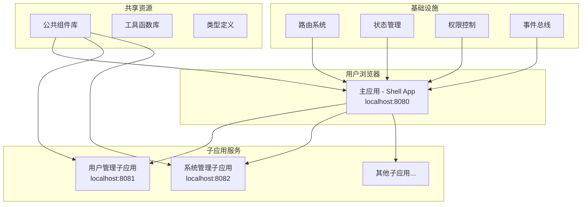
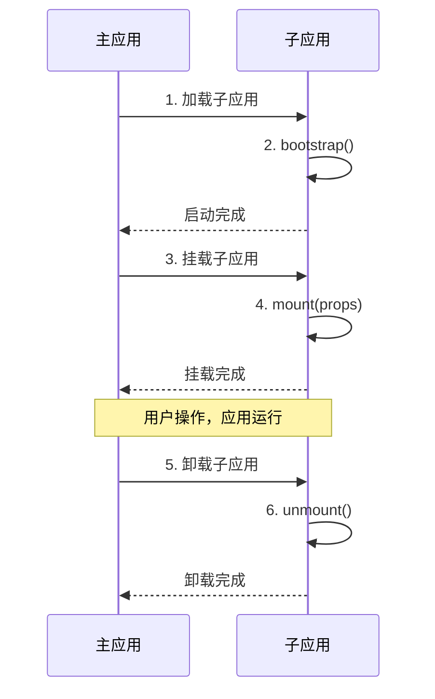

# 项目架构

本页面详细介绍了企业级微前端项目的架构设计和技术选型。

## 🏗️ 整体架构

### 微前端架构图



### 技术选型

| 技术领域 | 选择方案 | 版本 | 选择原因 |
|----------|----------|------|----------|
| **微前端框架** | Qiankun | 2.x | 成熟稳定，生态完善，阿里巴巴开源 |
| **前端框架** | Vue 3 | 3.x | 组合式API，性能优化，TypeScript支持 |
| **构建工具** | Vite | 7.x | 快速启动，HMR，现代化构建 |
| **类型系统** | TypeScript | 5.x | 类型安全，开发体验，代码质量 |
| **UI组件库** | Element Plus | 2.x | Vue3兼容，企业级组件 |
| **路由管理** | Vue Router | 4.x | 官方路由，与Vue3深度集成 |
| **包管理器** | pnpm | 8.x | 磁盘效率，依赖管理，Monorepo支持 |
| **部署平台** | Vercel | - | 自动化部署，CDN加速，零配置 |

## 🎯 架构设计原则

### 1. 主子应用分离
- **清晰的业务边界**：每个子应用负责独立的业务领域
- **技术栈独立**：子应用可以选择不同的技术栈（当前统一使用Vue3）
- **版本管理独立**：各子应用可以独立进行版本迭代

### 2. 独立开发部署
- **开发独立性**：各团队可以并行开发，减少代码冲突
- **部署独立性**：子应用可以单独部署，不影响其他应用
- **测试独立性**：独立的测试环境和测试流程

### 3. 统一基础设施
- **统一的UI规范**：使用相同的设计系统和组件库
- **统一的开发规范**：代码规范、Git提交规范等
- **统一的部署流程**：标准化的CI/CD流程

### 4. 高效通信机制
- **Props传递**：主应用向子应用传递配置和数据
- **事件总线**：跨应用的事件通信
- **全局状态**：共享状态管理
- **路由通信**：跨应用路由跳转

## 📁 目录结构设计

### 整体结构

```
qiankun-microfrontend/
├── main-app/                 # 主应用（壳应用）
│   ├── src/
│   │   ├── components/       # 公共组件
│   │   │   ├── Header/       # 顶部导航
│   │   │   ├── Sidebar/      # 侧边菜单
│   │   │   └── Layout/       # 布局组件
│   │   ├── micro/           # 微前端配置 ⭐
│   │   │   ├── index.ts      # 主配置文件
│   │   │   └── apps.ts       # 应用注册
│   │   ├── router/          # 路由配置
│   │   │   ├── index.ts      # 主路由
│   │   │   └── guards.ts     # 路由守卫
│   │   ├── shared/          # 共享模块
│   │   │   ├── eventBus.ts   # 事件总线
│   │   │   ├── utils/        # 工具函数
│   │   │   └── types/        # 类型定义
│   │   ├── views/           # 页面组件
│   │   │   ├── Dashboard/    # 仪表板
│   │   │   └── Layout/       # 布局页面
│   │   ├── assets/          # 静态资源
│   │   ├── styles/          # 全局样式
│   │   └── main.ts          # 入口文件
│   ├── public/              # 静态文件
│   ├── vite.config.ts       # Vite配置
│   ├── tsconfig.json        # TypeScript配置
│   └── package.json         # 依赖配置
├── sub-apps/                # 子应用目录
│   ├── user-management/     # 用户管理子应用
│   │   ├── src/
│   │   │   ├── components/  # 业务组件
│   │   │   ├── views/       # 页面组件
│   │   │   ├── router/      # 路由配置
│   │   │   ├── api/         # 接口定义
│   │   │   ├── stores/      # 状态管理
│   │   │   ├── utils/       # 工具函数
│   │   │   ├── types/       # 类型定义
│   │   │   └── main.ts      # 入口文件 ⭐
│   │   ├── vite.config.ts   # Vite配置 ⭐
│   │   └── package.json
│   └── system-management/   # 系统管理子应用
│       └── ...             # 结构同用户管理
├── shared/                  # 共享资源（已废弃）
├── scripts/                 # 部署脚本
├── docker/                  # Docker配置
├── nginx/                   # Nginx配置
├── docs/                    # 项目文档
├── docs-site/               # VitePress文档站点
├── .github/workflows/       # CI/CD配置
├── .vscode/                 # VSCode配置
├── .eslintrc.js             # ESLint配置
├── .prettierrc              # Prettier配置
├── tsconfig.json            # TypeScript根配置
└── package.json             # 根配置文件
```

### 主应用结构特点

- **micro/目录**：核心的微前端配置，负责子应用的注册和生命周期管理
- **shared/目录**：内部共享模块，避免外部依赖
- **components/目录**：全局公共组件，为所有子应用提供统一的UI组件

### 子应用结构特点

- **独立的package.json**：每个子应用都有独立的依赖管理
- **main.ts**：导出qiankun生命周期函数，同时支持独立运行
- **router/目录**：子应用的路由配置，需要考虑主应用的路由前缀

## 🔄 应用生命周期

### Qiankun生命周期



### 生命周期实现

```typescript
// 子应用 main.ts
import { createApp } from 'vue'
import App from './App.vue'
import router from './router'

let app: any = null

// qiankun生命周期 - 启动
export async function bootstrap() {
  console.log('[用户管理] 应用启动')
}

// qiankun生命周期 - 挂载
export async function mount(props: any) {
  console.log('[用户管理] 应用挂载', props)
  
  app = createApp(App)
  app.use(router)
  
  const container = props.container 
    ? props.container.querySelector('#app') 
    : '#app'
  
  app.mount(container)
}

// qiankun生命周期 - 卸载
export async function unmount() {
  console.log('[用户管理] 应用卸载')
  app?.unmount()
  app = null
}

// 独立运行
if (!window.__POWERED_BY_QIANKUN__) {
  mount({})
}
```

## 🌐 路由架构

### 路由设计模式

```mermaid
graph TD
    A[主应用路由] --> B[/dashboard - 仪表板]
    A --> C[/user/* - 用户管理]
    A --> D[/system/* - 系统管理]
    
    C --> E[用户管理子应用路由]
    E --> F[/user/list - 用户列表]
    E --> G[/user/detail/:id - 用户详情]
    E --> H[/user/add - 添加用户]
    
    D --> I[系统管理子应用路由]
    I --> J[/system/settings - 系统设置]
    I --> K[/system/logs - 操作日志]
    I --> L[/system/permissions - 权限管理]
```

### 路由配置示例

**主应用路由配置**：
```typescript
// main-app/src/router/index.ts
const routes = [
  {
    path: '/',
    redirect: '/dashboard'
  },
  {
    path: '/dashboard',
    component: Dashboard
  },
  {
    // 微前端路由通配符
    path: '/user/:pathMatch(.*)*',
    component: MicroApp
  },
  {
    path: '/system/:pathMatch(.*)*', 
    component: MicroApp
  }
]
```

**子应用路由配置**：
```typescript
// sub-apps/user-management/src/router/index.ts
const routes = [
  {
    path: '/user',
    redirect: '/user/list'
  },
  {
    path: '/user/list',
    component: UserList
  },
  {
    path: '/user/detail/:id',
    component: UserDetail
  }
]

// 路由基础路径配置
const router = createRouter({
  history: createWebHistory(
    window.__POWERED_BY_QIANKUN__ ? '/user' : '/'
  ),
  routes
})
```

## 🔗 通信架构

### 通信方式对比

| 通信方式 | 适用场景 | 优点 | 缺点 |
|----------|----------|------|------|
| **Props传递** | 主应用→子应用 | 简单直接，类型安全 | 单向传递，数据量有限 |
| **事件总线** | 跨应用通信 | 解耦性好，支持多对多 | 调试困难，类型检查弱 |
| **全局状态** | 共享数据 | 数据一致性好 | 状态管理复杂 |
| **URL参数** | 页面间跳转 | 可持久化，SEO友好 | 数据类型受限 |

### 事件总线实现

```typescript
// main-app/src/shared/eventBus.ts
class EventBus {
  private events: Record<string, Function[]> = {}
  
  // 订阅事件
  on(event: string, callback: Function) {
    if (!this.events[event]) {
      this.events[event] = []
    }
    this.events[event].push(callback)
  }
  
  // 发布事件
  emit(event: string, ...args: any[]) {
    if (!this.events[event]) return
    this.events[event].forEach(callback => {
      callback(...args)
    })
  }
  
  // 取消订阅
  off(event: string, callback?: Function) {
    if (!this.events[event]) return
    if (callback) {
      this.events[event] = this.events[event].filter(cb => cb !== callback)
    } else {
      delete this.events[event]
    }
  }
}

export const globalEventBus = new EventBus()
```

## 🛡️ 样式隔离

### 样式隔离策略

1. **qiankun沙箱机制**：自动隔离JS和CSS
2. **CSS Modules**：组件级样式隔离
3. **命名空间**：为每个应用添加唯一前缀
4. **Shadow DOM**：完全隔离的样式环境（可选）

### 实现示例

```vue
<!-- 子应用组件样式隔离 -->
<template>
  <div class="user-management">
    <h1 class="title">用户管理</h1>
  </div>
</template>

<style scoped>
.user-management {
  /* 样式只作用于当前组件 */
  padding: 20px;
}

.title {
  color: #333;
  font-size: 24px;
}
</style>
```

## 🚀 性能优化架构

### 优化策略

1. **按需加载**：子应用懒加载，减少初始包大小
2. **预加载**：智能预加载即将访问的子应用
3. **共享依赖**：抽取公共依赖，避免重复加载
4. **缓存策略**：合理配置浏览器缓存和CDN缓存

### 加载优化

```typescript
// 预加载策略
const preloadApps = ['user-management']

// 在适当时机预加载
function preloadMicroApps() {
  preloadApps.forEach(name => {
    import(/* webpackChunkName: "[request]" */ `../micro/${name}`)
  })
}

// 路由守卫中触发预加载
router.beforeEach((to, from, next) => {
  if (shouldPreload(to.path)) {
    preloadMicroApps()
  }
  next()
})
```

---

通过精心设计的架构，本项目实现了真正的微前端应用，为企业级应用开发提供了完整、可扩展的解决方案。