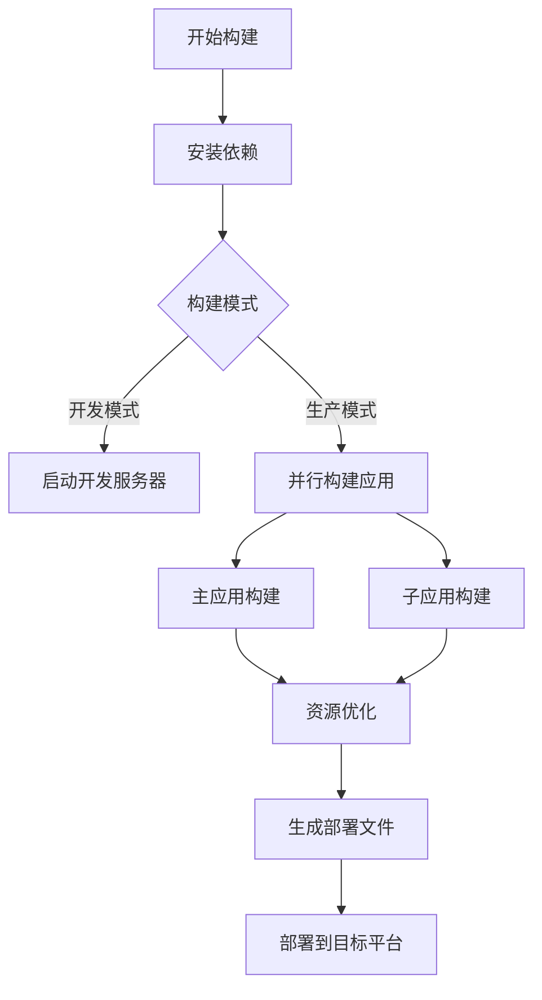

# 构建部署

本指南详细介绍如何构建和部署微前端项目，包括本地构建、生产构建、Docker构建等多种方式。

## 🏗️ 构建概述

微前端项目的构建需要分别构建主应用和各个子应用，然后进行整体的部署配置。

### 构建流程图



## 📦 依赖管理

### 安装依赖

```bash
# 安装根目录依赖
pnpm install

# 安装所有应用依赖（推荐）
pnpm install:all

# 单独安装某个应用依赖
pnpm --filter main-app install
pnpm --filter user-management install
pnpm --filter system-management install
```

### 依赖更新

```bash
# 更新所有依赖
pnpm update -r

# 更新特定依赖
pnpm --filter main-app update vue

# 检查过期依赖
pnpm outdated -r
```

## 🛠️ 本地构建

### 开发模式构建

```bash
# 启动所有应用（推荐）
pnpm dev

# 分别启动各应用
pnpm --filter main-app dev        # 主应用：http://localhost:8080
pnpm --filter user-management dev # 用户管理：http://localhost:8081
pnpm --filter system-management dev # 系统管理：http://localhost:8082
```

::: tip 开发模式特性
- 🔥 **热重载**：代码变更自动刷新
- 🚀 **快速启动**：Vite快速冷启动
- 🔍 **Source Map**：便于调试的源码映射
- 📝 **类型检查**：TypeScript实时类型检查
:::

### 预览模式

```bash
# 构建后预览
pnpm build
pnpm preview

# 单独预览某个应用
pnpm --filter main-app build
pnpm --filter main-app preview
```

## 🚀 生产构建

### 完整构建

```bash
# 构建所有应用
pnpm build

# 等价于以下命令的组合
pnpm build:main && pnpm build:user && pnpm build:system
```

### 单独构建

```bash
# 构建主应用
pnpm build:main
# 或
pnpm --filter main-app build

# 构建用户管理子应用
pnpm build:user
# 或
pnpm --filter user-management build

# 构建系统管理子应用
pnpm build:system
# 或
pnpm --filter system-management build
```

### 构建产物

构建完成后，各应用的产物位置：

```
project-root/
├── main-app/dist/              # 主应用构建产物
│   ├── index.html
│   ├── assets/
│   │   ├── index-[hash].js
│   │   ├── index-[hash].css
│   │   └── vendor-[hash].js
│   └── favicon.ico
├── sub-apps/
│   ├── user-management/dist/   # 用户管理构建产物
│   └── system-management/dist/ # 系统管理构建产物
```

## ⚙️ 构建配置

### Vite构建配置

主应用配置示例：

```typescript
// main-app/vite.config.ts
import { defineConfig } from 'vite'
import vue from '@vitejs/plugin-vue'
import { resolve } from 'path'

export default defineConfig({
  plugins: [vue()],
  
  // 构建配置
  build: {
    outDir: 'dist',
    assetsDir: 'assets',
    sourcemap: false,
    minify: 'terser',
    target: 'es2015',
    
    // 代码分割
    rollupOptions: {
      output: {
        chunkFileNames: 'assets/[name]-[hash].js',
        entryFileNames: 'assets/[name]-[hash].js',
        assetFileNames: 'assets/[name]-[hash].[ext]',
        
        // 手动分割chunks
        manualChunks: {
          'vue-vendor': ['vue', 'vue-router'],
          'element-vendor': ['element-plus'],
          'qiankun-vendor': ['qiankun']
        }
      }
    },
    
    // 构建优化
    terserOptions: {
      compress: {
        drop_console: true,
        drop_debugger: true
      }
    }
  },
  
  // 开发服务器配置
  server: {
    port: 8080,
    host: '0.0.0.0',
    cors: true
  },
  
  // 路径解析
  resolve: {
    alias: {
      '@': resolve(__dirname, 'src')
    }
  }
})
```

子应用配置示例：

```typescript
// sub-apps/user-management/vite.config.ts
import { defineConfig } from 'vite'
import vue from '@vitejs/plugin-vue'
import qiankun from 'vite-plugin-qiankun'

export default defineConfig({
  plugins: [
    vue(),
    qiankun('user-management', {
      useDevMode: true
    })
  ],
  
  // 构建配置
  build: {
    outDir: 'dist',
    lib: {
      entry: 'src/main.ts',
      name: 'userManagement',
      formats: ['umd']
    },
    rollupOptions: {
      external: ['vue'],
      output: {
        globals: {
          vue: 'Vue'
        }
      }
    }
  },
  
  server: {
    port: 8081,
    cors: true,
    headers: {
      'Access-Control-Allow-Origin': '*'
    }
  }
})
```

### TypeScript配置

```json
// tsconfig.json
{
  "compilerOptions": {
    "target": "ES2020",
    "useDefineForClassFields": true,
    "lib": ["ES2020", "DOM", "DOM.Iterable"],
    "module": "ESNext",
    "skipLibCheck": true,
    
    "moduleResolution": "bundler",
    "allowImportingTsExtensions": true,
    "resolveJsonModule": true,
    "isolatedModules": true,
    "noEmit": true,
    "jsx": "preserve",
    
    "strict": true,
    "noUnusedLocals": true,
    "noUnusedParameters": true,
    "noFallthroughCasesInSwitch": true,
    
    "baseUrl": ".",
    "paths": {
      "@/*": ["src/*"]
    }
  },
  "include": ["src/**/*.ts", "src/**/*.d.ts", "src/**/*.tsx", "src/**/*.vue"],
  "references": [{ "path": "./tsconfig.node.json" }]
}
```

## 🐳 Docker构建

### Dockerfile配置

主应用Dockerfile：

```dockerfile
# docker/main-app.Dockerfile
FROM node:18-alpine AS builder

WORKDIR /app

# 复制package文件
COPY package*.json ./
COPY main-app/package*.json ./main-app/

# 安装依赖
RUN npm install -g pnpm
RUN pnpm install

# 复制源码
COPY main-app/ ./main-app/

# 构建应用
WORKDIR /app/main-app
RUN pnpm build

# 生产镜像
FROM nginx:alpine

# 复制构建产物
COPY --from=builder /app/main-app/dist /usr/share/nginx/html

# 复制nginx配置
COPY nginx/nginx.conf /etc/nginx/nginx.conf

EXPOSE 80

CMD ["nginx", "-g", "daemon off;"]
```

### Docker Compose

```yaml
# docker-compose.yml
version: '3.8'

services:
  main-app:
    build:
      context: .
      dockerfile: docker/main-app.Dockerfile
    ports:
      - "8080:80"
    environment:
      - NODE_ENV=production
    networks:
      - microfrontend-network

  user-management:
    build:
      context: .
      dockerfile: docker/user-management.Dockerfile
    ports:
      - "8081:80"
    networks:
      - microfrontend-network

  system-management:
    build:
      context: .
      dockerfile: docker/system-management.Dockerfile
    ports:
      - "8082:80"
    networks:
      - microfrontend-network

networks:
  microfrontend-network:
    driver: bridge
```

### Docker构建命令

```bash
# 构建所有镜像
docker-compose build

# 构建特定镜像
docker build -f docker/main-app.Dockerfile -t main-app:latest .

# 启动所有服务
docker-compose up -d

# 查看运行状态
docker-compose ps

# 查看日志
docker-compose logs -f main-app
```

## 🔧 构建优化

### 性能优化

1. **代码分割**：

```typescript
// 路由懒加载
const routes = [
  {
    path: '/user',
    component: () => import('@/views/UserManagement.vue')
  }
]

// 组件懒加载
const AsyncComponent = defineAsyncComponent(() => 
  import('@/components/HeavyComponent.vue')
)
```

2. **资源优化**：

```typescript
// vite.config.ts
export default defineConfig({
  build: {
    // 资源内联阈值
    assetsInlineLimit: 4096,
    
    // 启用gzip压缩
    reportCompressedSize: true,
    
    // 移除console
    terserOptions: {
      compress: {
        drop_console: true,
        drop_debugger: true
      }
    }
  }
})
```

3. **依赖外部化**：

```typescript
// 子应用配置
export default defineConfig({
  build: {
    rollupOptions: {
      // 外部化依赖，由主应用提供
      external: ['vue', 'vue-router', 'element-plus'],
      output: {
        globals: {
          vue: 'Vue',
          'vue-router': 'VueRouter',
          'element-plus': 'ElementPlus'
        }
      }
    }
  }
})
```

### 构建分析

```bash
# 安装分析工具
pnpm add -D rollup-plugin-visualizer

# 分析构建产物
pnpm build --analyze

# 或使用webpack-bundle-analyzer
npx webpack-bundle-analyzer dist/static/js/*.js
```

## 📊 构建监控

### 构建时间优化

```bash
# 使用build-time插件监控构建时间
# 记录构建开始时间
echo "构建开始: $(date)"

# 执行构建
time pnpm build

# 记录构建结束时间
echo "构建完成: $(date)"
```

### 产物大小监控

```bash
# 检查产物大小
du -sh */dist

# 详细分析
ls -lah main-app/dist/assets/
```

## 🚀 CI/CD集成

### GitHub Actions构建

```yaml
# .github/workflows/build.yml
name: Build and Test

on:
  push:
    branches: [ main, develop ]
  pull_request:
    branches: [ main ]

jobs:
  build:
    runs-on: ubuntu-latest
    
    steps:
    - uses: actions/checkout@v3
    
    - name: Setup Node.js
      uses: actions/setup-node@v3
      with:
        node-version: '18'
        
    - name: Install pnpm
      uses: pnpm/action-setup@v2
      with:
        version: 8
        
    - name: Install dependencies
      run: pnpm install:all
      
    - name: Type check
      run: pnpm type-check
      
    - name: Lint
      run: pnpm lint
      
    - name: Build
      run: pnpm build
      
    - name: Upload build artifacts
      uses: actions/upload-artifact@v3
      with:
        name: build-artifacts
        path: |
          main-app/dist
          sub-apps/*/dist
```

## 🔍 构建问题排查

### 常见构建错误

1. **依赖版本冲突**：
```bash
# 清理依赖重新安装
rm -rf node_modules */node_modules
rm pnpm-lock.yaml */pnpm-lock.yaml
pnpm install:all
```

2. **内存不足**：
```bash
# 增加Node.js内存限制
export NODE_OPTIONS="--max-old-space-size=4096"
pnpm build
```

3. **TypeScript错误**：
```bash
# 类型检查
pnpm type-check

# 跳过类型检查构建
pnpm build --no-type-check
```

### 构建日志分析

```bash
# 详细构建日志
pnpm build --verbose

# 调试模式
DEBUG=vite:* pnpm build
```

---

通过合理的构建配置和优化策略，可以显著提升构建效率和应用性能。更多问题请参考[问题排查](../troubleshooting/)页面。