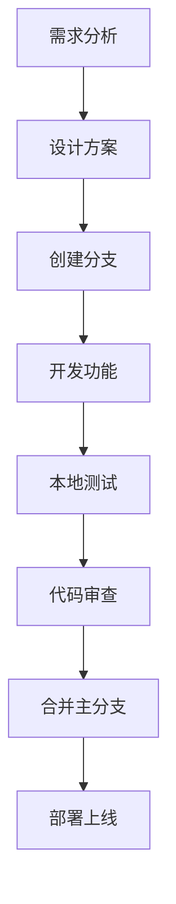

# 开发指南

本指南详细介绍如何在微前端项目中进行开发，包括添加新功能、创建新子应用、调试技巧等。

## 🛠️ 开发环境搭建

### IDE配置

推荐使用 **VSCode** 作为开发环境，并安装以下插件：

```json
{
  "recommendations": [
    "Vue.volar",                              // Vue 3 支持
    "Vue.vscode-typescript-vue-plugin",       // Vue TypeScript 插件
    "esbenp.prettier-vscode",                 // 代码格式化
    "dbaeumer.vscode-eslint",                 // 代码检查
    "bradlc.vscode-tailwindcss",              // TailwindCSS 支持
    "ms-vscode.vscode-typescript-next",       // TypeScript 支持
    "formulahendry.auto-rename-tag",          // 标签自动重命名
    "christian-kohler.path-intellisense"      // 路径智能提示
  ]
}
```

### 工作区配置

创建 `.vscode/settings.json` 配置文件：

```json
{
  "editor.codeActionsOnSave": {
    "source.fixAll.eslint": true
  },
  "editor.formatOnSave": true,
  "editor.defaultFormatter": "esbenp.prettier-vscode",
  "[vue]": {
    "editor.defaultFormatter": "Vue.volar"
  },
  "typescript.preferences.importModuleSpecifier": "relative"
}
```

## 🏗️ 项目开发工作流

### 1. 功能开发流程



### 2. 分支管理策略

```bash
# 创建功能分支
git checkout -b feature/user-management-enhancement

# 提交代码
git add .
git commit -m "feat(user): 添加用户批量操作功能"

# 推送分支
git push origin feature/user-management-enhancement

# 创建PR并合并
```

### 3. 提交规范

采用 [Conventional Commits](https://www.conventionalcommits.org/) 规范：

```bash
# 功能开发
git commit -m "feat(user): 添加用户搜索功能"

# 问题修复
git commit -m "fix(system): 修复菜单权限显示问题"

# 文档更新
git commit -m "docs: 更新部署指南"

# 样式调整
git commit -m "style(ui): 调整按钮间距"

# 重构代码
git commit -m "refactor(api): 重构用户接口逻辑"

# 性能优化
git commit -m "perf(app): 优化路由懒加载性能"

# 测试相关
git commit -m "test(user): 添加用户组件单元测试"
```

## 🎯 主应用开发

### 添加新的子应用

1. **创建子应用目录**：

```bash
mkdir sub-apps/new-module
cd sub-apps/new-module
```

2. **初始化子应用**：

```bash
# 复制现有子应用结构
cp -r ../user-management/* .

# 修改package.json
{
  "name": "new-module",
  "scripts": {
    "dev": "vite --port 8083"
  }
}
```

3. **注册子应用到主应用**：

```typescript
// main-app/src/micro/apps.ts
export const microApps = [
  {
    name: 'user-management',
    entry: '//localhost:8081',
    container: '#subapp-viewport',
    activeRule: '/user',
  },
  {
    name: 'system-management',
    entry: '//localhost:8082', 
    container: '#subapp-viewport',
    activeRule: '/system',
  },
  // 新增子应用
  {
    name: 'new-module',
    entry: '//localhost:8083',
    container: '#subapp-viewport',
    activeRule: '/new-module',
  }
]
```

4. **添加路由配置**：

```typescript
// main-app/src/router/index.ts
const routes = [
  // ... 现有路由
  {
    path: '/new-module/:pathMatch(.*)*',
    component: MicroApp,
    meta: {
      title: '新模块',
      requiresAuth: true
    }
  }
]
```

5. **更新导航菜单**：

```typescript
// main-app/src/components/Sidebar/menuConfig.ts
export const menuItems = [
  // ... 现有菜单
  {
    key: 'new-module',
    label: '新模块',
    icon: 'IconModule',
    path: '/new-module'
  }
]
```

### 公共组件开发

在主应用中开发可复用的公共组件：

```vue
<!-- main-app/src/components/Common/DataTable.vue -->
<template>
  <div class="data-table">
    <el-table
      :data="data"
      :loading="loading"
      @selection-change="handleSelectionChange"
    >
      <el-table-column
        v-for="column in columns"
        :key="column.prop"
        v-bind="column"
      />
    </el-table>
    
    <el-pagination
      v-if="showPagination"
      :current-page="pagination.current"
      :page-size="pagination.pageSize"
      :total="pagination.total"
      @current-change="handlePageChange"
    />
  </div>
</template>

<script setup lang="ts">
interface Column {
  prop: string
  label: string
  width?: number
  formatter?: (value: any) => string
}

interface Props {
  data: any[]
  columns: Column[]
  loading?: boolean
  showPagination?: boolean
  pagination?: {
    current: number
    pageSize: number
    total: number
  }
}

const props = withDefaults(defineProps<Props>(), {
  loading: false,
  showPagination: true
})

const emit = defineEmits<{
  selectionChange: [selection: any[]]
  pageChange: [page: number]
}>()

const handleSelectionChange = (selection: any[]) => {
  emit('selectionChange', selection)
}

const handlePageChange = (page: number) => {
  emit('pageChange', page)
}
</script>
```

## 🎨 子应用开发

### 创建新页面

1. **创建页面组件**：

```vue
<!-- sub-apps/user-management/src/views/UserProfile.vue -->
<template>
  <div class="user-profile">
    <page-header title="用户详情" :breadcrumb="breadcrumb" />
    
    <el-card>
      <el-form :model="userForm" label-width="100px">
        <el-form-item label="用户名">
          <el-input v-model="userForm.username" disabled />
        </el-form-item>
        <el-form-item label="邮箱">
          <el-input v-model="userForm.email" />
        </el-form-item>
        <!-- 更多表单项 -->
      </el-form>
      
      <div class="actions">
        <el-button @click="handleCancel">取消</el-button>
        <el-button type="primary" @click="handleSave">保存</el-button>
      </div>
    </el-card>
  </div>
</template>

<script setup lang="ts">
import { ref, onMounted } from 'vue'
import { useRoute, useRouter } from 'vue-router'
import { getUserById, updateUser } from '@/api/user'
import type { User } from '@/types/user'

const route = useRoute()
const router = useRouter()

const userForm = ref<Partial<User>>({})
const loading = ref(false)

const breadcrumb = [
  { label: '用户管理', path: '/user' },
  { label: '用户列表', path: '/user/list' },
  { label: '用户详情' }
]

onMounted(async () => {
  const userId = route.params.id as string
  if (userId) {
    await loadUserData(userId)
  }
})

const loadUserData = async (id: string) => {
  try {
    loading.value = true
    const response = await getUserById(id)
    userForm.value = response.data
  } catch (error) {
    console.error('加载用户数据失败:', error)
  } finally {
    loading.value = false
  }
}

const handleSave = async () => {
  try {
    loading.value = true
    await updateUser(userForm.value)
    ElMessage.success('保存成功')
    router.push('/user/list')
  } catch (error) {
    ElMessage.error('保存失败')
  } finally {
    loading.value = false
  }
}

const handleCancel = () => {
  router.push('/user/list')
}
</script>
```

2. **添加路由配置**：

```typescript
// sub-apps/user-management/src/router/index.ts
const routes = [
  // ... 现有路由
  {
    path: '/user/profile/:id',
    name: 'UserProfile',
    component: () => import('@/views/UserProfile.vue'),
    meta: {
      title: '用户详情',
      requiresAuth: true
    }
  }
]
```

### API接口开发

1. **定义接口类型**：

```typescript
// sub-apps/user-management/src/types/user.ts
export interface User {
  id: string
  username: string
  email: string
  phone: string
  role: string
  status: 'active' | 'inactive'
  createdAt: string
  updatedAt: string
}

export interface UserListParams {
  page: number
  pageSize: number
  keyword?: string
  role?: string
  status?: string
}

export interface UserListResponse {
  list: User[]
  total: number
}
```

2. **创建API服务**：

```typescript
// sub-apps/user-management/src/api/user.ts
import { request } from '@/utils/request'
import type { User, UserListParams, UserListResponse } from '@/types/user'

// 获取用户列表
export const getUserList = (params: UserListParams) => {
  return request.get<UserListResponse>('/api/users', { params })
}

// 获取用户详情
export const getUserById = (id: string) => {
  return request.get<User>(`/api/users/${id}`)
}

// 创建用户
export const createUser = (data: Omit<User, 'id' | 'createdAt' | 'updatedAt'>) => {
  return request.post<User>('/api/users', data)
}

// 更新用户
export const updateUser = (data: Partial<User>) => {
  return request.put<User>(`/api/users/${data.id}`, data)
}

// 删除用户
export const deleteUser = (id: string) => {
  return request.delete(`/api/users/${id}`)
}
```

3. **HTTP请求封装**：

```typescript
// sub-apps/user-management/src/utils/request.ts
import axios, { type AxiosResponse } from 'axios'
import { ElMessage } from 'element-plus'

const request = axios.create({
  baseURL: process.env.NODE_ENV === 'development' 
    ? 'http://localhost:3000' 
    : 'https://api.example.com',
  timeout: 10000
})

// 请求拦截器
request.interceptors.request.use(
  (config) => {
    // 添加认证头
    const token = localStorage.getItem('token')
    if (token) {
      config.headers.Authorization = `Bearer ${token}`
    }
    return config
  },
  (error) => {
    return Promise.reject(error)
  }
)

// 响应拦截器
request.interceptors.response.use(
  (response: AxiosResponse) => {
    const { code, message, data } = response.data
    
    if (code === 200) {
      return data
    } else {
      ElMessage.error(message || '请求失败')
      return Promise.reject(new Error(message))
    }
  },
  (error) => {
    ElMessage.error(error.message || '网络错误')
    return Promise.reject(error)
  }
)

export { request }
```

## 🔄 应用间通信

### 事件通信

1. **发送事件**：

```typescript
// 子应用发送事件
import { globalEventBus } from '@/shared/eventBus'

// 用户状态更新事件
const handleUserStatusChange = (userId: string, status: string) => {
  globalEventBus.emit('user:statusChanged', { userId, status })
}
```

2. **监听事件**：

```typescript
// 主应用或其他子应用监听事件
import { globalEventBus } from '@/shared/eventBus'
import { onMounted, onUnmounted } from 'vue'

onMounted(() => {
  // 监听用户状态变更
  globalEventBus.on('user:statusChanged', handleUserStatusChange)
})

onUnmounted(() => {
  // 清理事件监听
  globalEventBus.off('user:statusChanged', handleUserStatusChange)
})

const handleUserStatusChange = (data: any) => {
  console.log('用户状态变更:', data)
  // 处理状态变更逻辑
}
```

### 路由通信

```typescript
// 跨应用路由跳转
import { useRouter } from 'vue-router'

const router = useRouter()

// 从用户管理跳转到系统管理
const navigateToSystem = () => {
  router.push('/system/settings')
}

// 携带参数跳转
const navigateWithParams = (userId: string) => {
  router.push({
    path: '/system/user-permissions',
    query: { userId }
  })
}
```

## 🧪 调试技巧

### 1. 开发者工具

使用 Vue DevTools 调试：

```bash
# 安装 Vue DevTools 浏览器插件
# Chrome: Vue.js devtools
# Firefox: Vue.js devtools
```

### 2. 网络调试

```typescript
// 开启详细日志
if (process.env.NODE_ENV === 'development') {
  console.log('[微前端] 子应用加载:', appName)
  console.log('[微前端] 路由变化:', to.path)
  console.log('[微前端] 事件触发:', eventName, data)
}
```

### 3. 性能分析

```typescript
// 性能监控
const performanceObserver = new PerformanceObserver((list) => {
  list.getEntries().forEach((entry) => {
    console.log('Performance:', entry.name, entry.duration)
  })
})

performanceObserver.observe({ entryTypes: ['navigation', 'resource'] })
```

### 4. 错误追踪

```typescript
// 全局错误处理
window.addEventListener('error', (event) => {
  console.error('全局错误:', event.error)
  // 发送错误信息到监控系统
})

// Vue错误处理
app.config.errorHandler = (err, vm, info) => {
  console.error('Vue错误:', err, info)
}
```

## 📝 代码规范

### TypeScript规范

```typescript
// 使用接口定义类型
interface UserFormData {
  readonly id?: string
  username: string
  email: string
  roles: Role[]
}

// 使用泛型
function createApiService<T>(baseURL: string): ApiService<T> {
  // 实现
}

// 使用枚举
enum UserStatus {
  ACTIVE = 'active',
  INACTIVE = 'inactive',
  PENDING = 'pending'
}
```

### Vue规范

```vue
<template>
  <!-- 使用语义化的class名称 -->
  <div class="user-list-container">
    <!-- 使用v-for时添加key -->
    <div
      v-for="user in userList"
      :key="user.id"
      class="user-item"
    >
      <!-- 条件渲染使用v-if/v-else -->
      <span v-if="user.status === 'active'" class="status active">
        活跃
      </span>
      <span v-else class="status inactive">
        非活跃
      </span>
    </div>
  </div>
</template>

<script setup lang="ts">
// 组件导入
import { ref, computed, onMounted } from 'vue'
import type { User } from '@/types/user'

// Props定义
interface Props {
  initialData?: User[]
  showPagination?: boolean
}

const props = withDefaults(defineProps<Props>(), {
  initialData: () => [],
  showPagination: true
})

// Emits定义
const emit = defineEmits<{
  userSelect: [user: User]
  pageChange: [page: number]
}>()

// 响应式数据
const userList = ref<User[]>([])
const loading = ref(false)

// 计算属性
const activeUsers = computed(() => 
  userList.value.filter(user => user.status === 'active')
)

// 生命周期
onMounted(() => {
  loadUserList()
})
</script>

<style scoped>
.user-list-container {
  /* 样式实现 */
}
</style>
```

---

遵循这些开发规范和最佳实践，可以确保代码质量和团队协作效率。如有疑问，请参考[问题排查](../troubleshooting/)页面。