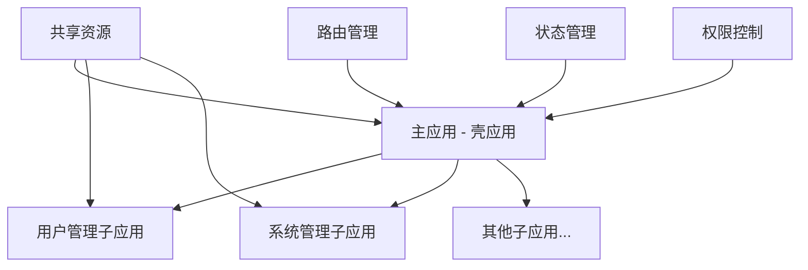
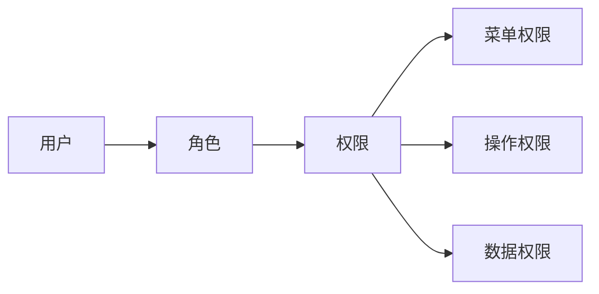

# 项目介绍

## 🎯 项目概述

企业级微前端管理后台系统是一个基于现代化技术栈构建的完整解决方案，专为解决大型企业应用的复杂性和可维护性问题而设计。

### 🏗️ 项目背景

传统的单体应用在企业级项目中面临诸多挑战：
- **团队协作困难**：多团队开发容易产生冲突
- **技术栈固化**：难以引入新技术和框架
- **部署复杂性**：整体部署风险高，回滚困难
- **维护成本高**：代码耦合度高，修改影响面大

微前端架构通过将大型应用拆分为多个独立的子应用，有效解决了这些问题。

## 🔧 技术架构

### 核心技术栈

| 技术 | 版本 | 用途 |
|------|------|------|
| Vue 3 | 3.x | 前端框架 |
| TypeScript | 5.x | 类型系统 |
| Vite | 7.x | 构建工具 |
| Qiankun | 2.x | 微前端框架 |
| Element Plus | 2.x | UI组件库 |
| Vue Router | 4.x | 路由管理 |
| pnpm | 8.x | 包管理器 |

### 架构设计



### 应用间通信

1. **Props传递**：主应用向子应用传递配置信息
2. **事件总线**：跨应用的事件通信机制
3. **共享状态**：全局状态管理
4. **路由通信**：跨应用的路由跳转

## 📊 项目结构

```
enterprise-microfrontend/
├── main-app/                    # 主应用（壳应用）
│   ├── src/
│   │   ├── components/         # 公共组件
│   │   ├── micro/             # 微前端配置
│   │   ├── router/            # 路由配置
│   │   ├── shared/            # 共享模块
│   │   ├── views/             # 页面组件
│   │   └── main.ts            # 入口文件
│   ├── vite.config.ts         # Vite配置
│   └── package.json
├── sub-apps/                   # 子应用目录
│   ├── user-management/        # 用户管理子应用
│   │   ├── src/
│   │   ├── vite.config.ts
│   │   └── package.json
│   └── system-management/      # 系统管理子应用
│       ├── src/
│       ├── vite.config.ts
│       └── package.json
├── docs/                       # 项目文档
├── docs-site/                  # VitePress文档站点
├── scripts/                    # 部署脚本
├── docker/                     # Docker配置
├── nginx/                      # Nginx配置
├── .github/workflows/          # GitHub Actions
└── package.json               # 根package.json
```

## 🎨 功能特性

### 主应用功能

- **应用壳**：提供统一的应用框架和布局
- **路由管理**：协调主子应用的路由系统
- **子应用注册**：动态注册和加载子应用
- **公共组件**：头部导航、侧边栏、面包屑等
- **权限控制**：统一的权限管理和路由守卫

### 子应用功能

#### 用户管理子应用
- 用户列表展示和分页
- 用户信息的增删改查
- 用户权限管理
- 批量操作功能

#### 系统管理子应用
- 系统配置管理
- 菜单权限配置
- 操作日志查看
- 系统监控面板

## 🔐 权限系统

### 权限设计



### 权限控制

1. **路由权限**：基于角色的路由访问控制
2. **菜单权限**：动态菜单生成和权限过滤
3. **按钮权限**：页面内按钮级别的权限控制
4. **数据权限**：基于角色的数据访问控制

## 🌟 核心优势

### 开发优势

- **独立开发**：各子应用可独立开发、测试、部署
- **技术栈自由**：子应用可选择不同的技术栈
- **代码隔离**：避免代码冲突和相互影响
- **团队协作**：支持多团队并行开发

### 部署优势

- **独立部署**：子应用可单独部署更新
- **灰度发布**：支持子应用的灰度发布
- **回滚简单**：出现问题可快速回滚
- **资源优化**：按需加载和共享资源

### 维护优势

- **职责清晰**：模块边界明确，便于维护
- **影响范围小**：修改影响范围可控
- **技术升级**：可渐进式技术栈升级
- **性能优化**：独立的性能优化空间

## 📈 性能优化

### 加载优化

- **懒加载**：子应用按需加载
- **预加载**：智能预加载策略
- **缓存策略**：合理的缓存配置
- **CDN加速**：静态资源CDN分发

### 运行优化

- **代码分割**：合理的代码分割策略
- **共享依赖**：避免重复加载相同依赖
- **内存管理**：子应用卸载时的内存清理
- **样式隔离**：避免样式冲突和污染

## 🎯 适用场景

### 理想场景

- **大型企业应用**：功能模块众多，需要模块化管理
- **多团队开发**：不同团队负责不同业务模块
- **技术栈迁移**：需要渐进式技术栈升级
- **业务快速迭代**：需要频繁发布和独立部署

### 考虑因素

- **项目复杂度**：简单项目可能不需要微前端
- **团队规模**：小团队可能管理成本较高
- **技术能力**：需要团队具备相应的技术能力
- **基础设施**：需要完善的基础设施支持

---

通过合理的架构设计和技术选型，本项目为企业级应用开发提供了一个完整、可扩展的解决方案。