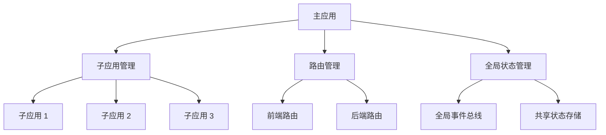
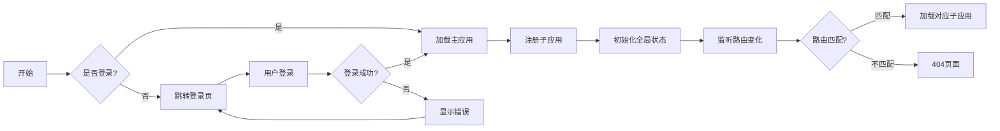
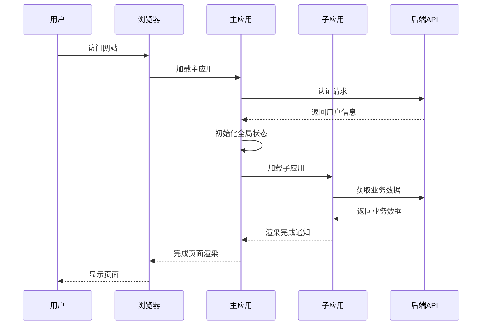
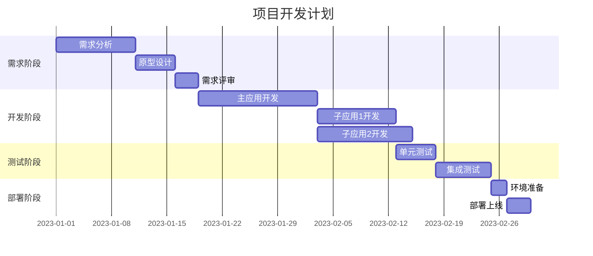
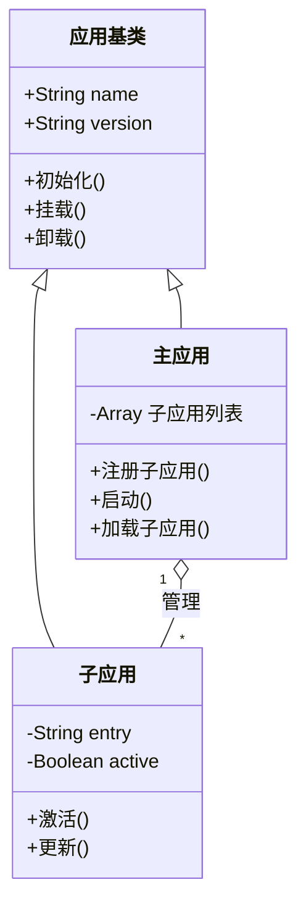
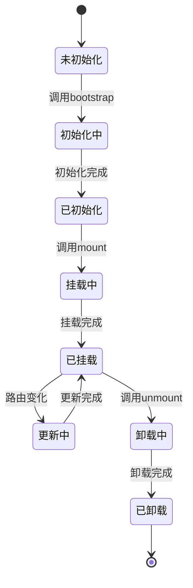

# Mermaid 图表示例

本页面展示了带有缩放功能的 Mermaid 图表。

## 基本用法

点击图表可以放大查看，在放大状态下点击右上角关闭按钮或按 ESC 键可以关闭放大视图。

```mermaid
graph TB
    A[主应用] --> B[子应用管理]
    A --> C[路由管理]
    A --> D[全局状态管理]
    B --> E[子应用 1]
    B --> F[子应用 2]
    B --> G[子应用 3]
    C --> H[前端路由]
    C --> I[后端路由]
    D --> J[全局事件总线]
    D --> K[共享状态存储]
```

## 流程图示例

这是一个较为复杂的流程图，可以点击放大查看细节。

```mermaid
graph LR
    A[开始] --> B{是否登录?}
    B -- 是 --> C[加载主应用]
    B -- 否 --> D[跳转登录页]
    C --> E[注册子应用]
    E --> F[初始化全局状态]
    F --> G[监听路由变化]
    G --> H{路由匹配?}
    H -- 匹配 --> I[加载对应子应用]
    H -- 不匹配 --> J[404页面]
    D --> K[用户登录]
    K --> L{登录成功?}
    L -- 是 --> C
    L -- 否 --> M[显示错误]
    M --> D
```

## 序列图示例

```mermaid
sequenceDiagram
    participant 用户
    participant 浏览器
    participant 主应用
    participant 子应用
    participant 后端API

    用户->>浏览器: 访问网站
    浏览器->>主应用: 加载主应用
    主应用->>后端API: 认证请求
    后端API-->>主应用: 返回用户信息
    主应用->>主应用: 初始化全局状态
    主应用->>子应用: 加载子应用
    子应用->>后端API: 获取业务数据
    后端API-->>子应用: 返回业务数据
    子应用-->>主应用: 渲染完成通知
    主应用-->>浏览器: 完成页面渲染
    浏览器-->>用户: 显示页面
```

## 甘特图示例

```mermaid
gantt
    title 项目开发计划
    dateFormat  YYYY-MM-DD
    section 需求阶段
    需求分析       :a1, 2023-01-01, 10d
    原型设计       :a2, after a1, 5d
    需求评审       :a3, after a2, 3d
    section 开发阶段
    主应用开发     :b1, after a3, 15d
    子应用1开发    :b2, after b1, 10d
    子应用2开发    :b3, after b1, 12d
    section 测试阶段
    单元测试       :c1, after b2, 5d
    集成测试       :c2, after c1, 7d
    section 部署阶段
    环境准备       :d1, after c2, 2d
    部署上线       :d2, after d1, 3d
```

## 类图示例

```mermaid
classDiagram
    class 应用基类 {
        +String name
        +String version
        +初始化()
        +挂载()
        +卸载()
    }
    class 主应用 {
        -Array 子应用列表
        +注册子应用()
        +启动()
        +加载子应用()
    }
    class 子应用 {
        -String entry
        -Boolean active
        +激活()
        +更新()
    }
    应用基类 <|-- 主应用
    应用基类 <|-- 子应用
    主应用 "1" o-- "*" 子应用: 管理
```

## 状态图示例

```mermaid
stateDiagram-v2
    [*] --> 未初始化
    未初始化 --> 初始化中: 调用bootstrap
    初始化中 --> 已初始化: 初始化完成
    已初始化 --> 挂载中: 调用mount
    挂载中 --> 已挂载: 挂载完成
    已挂载 --> 更新中: 路由变化
    更新中 --> 已挂载: 更新完成
    已挂载 --> 卸载中: 调用unmount
    卸载中 --> 已卸载: 卸载完成
    已卸载 --> [*]
```