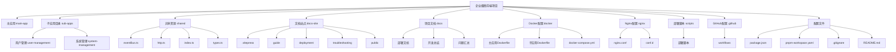

# 项目结构图

为了更直观地理解项目结构，以下是项目整体架构的 Mermaid 图表表示。

```mermaid
graph TD
    A[企业级微前端项目] --> B[主应用 main-app]
    A --> C[子应用目录 sub-apps]
    A --> D[共享资源 shared]
    A --> E[文档站点 docs-site]
    A --> F[项目文档 docs]
    A --> G[Docker配置 docker]
    A --> H[Nginx配置 nginx]
    A --> I[部署脚本 scripts]
    A --> J[GitHub配置 .github]
    A --> K[配置文件]
    
    C --> C1[用户管理 user-management]
    C --> C2[系统管理 system-management]
    
    D --> D1[eventBus.ts]
    D --> D2[http.ts]
    D --> D3[index.ts]
    D --> D4[types.ts]
    
    E --> E1[.vitepress]
    E --> E2[guide]
    E --> E3[deployment]
    E --> E4[troubleshooting]
    E --> E5[public]
    
    F --> F1[部署文档]
    F --> F2[开发总结]
    F --> F3[问题汇总]
    
    G --> G1[主应用Dockerfile]
    G --> G2[子应用Dockerfile]
    G --> G3[docker-compose.yml]
    
    H --> H1[nginx.conf]
    H --> H2[conf.d]
    
    I --> I1[部署脚本]
    
    J --> J1[workflows]
    
    K --> K1[package.json]
    K --> K2[pnpm-workspace.yaml]
    K --> K3[.gitignore]
    K --> K4[README.md]
```

这个图表展示了项目的主要组成部分及其关系，帮助开发者快速理解项目的整体架构。